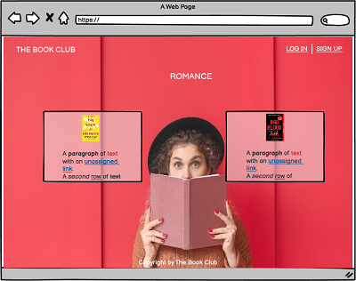
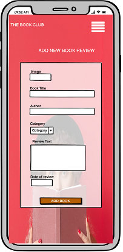

# The Book Club

Milestone Project 3 - Python and Data Centric Development

The website is created with the purpose to motivate people to read more books and share their opinions about the books they read.
The site will be targeted at the people who love to read books and people who doubt what to read.
Nowadays there is a huge choice of books for different ages, interests, and topics. Any one of us can get confused in this sea of books.
That is why book review and recommendation sites are here to help solve it. 
Existing user book reviews will help to choose and understand which could be your next book to read.
Go to website ...

## UX

### Mockup

### User stories

As a first time visitor I want 
- to immediately understand what is the purpose of this website
- to see content without being register
- to be able to see content by Categories
- to be able to register easily without needing to input a lot of personal information
- to see that website is active and when is the latest book review added 

As a returning user I want 
- to Log In and Log Out easily
- to be able add new book review easily
- to be able to edit or delete my book reviews
- to upload my own images using URL
- to have my dashboard and see all my reviews
- to Delete my profile easily

As a site owner/admin I want
- to be able to edit and delete content created by users
- to be able to add, edit and delete Categories

### Design Choices

The overall feel of the website is clean and not crowded design. As a main element of the website I chose bright background image with girl on it.
The image gives the right mood and fits to headline question.

#### Fonts

As website is made with Bootstrap, all fonts were given by default. 

#### Colours

As background image was chosen in bright color itself, all other element colors are chosen neutral, matching colors. Like, text and Navbar is white,
buttons and icons are nude/brovn shade, color name is Contessa. This color was chosen because the same shade is in girls sweater.
That gives good match and overall clean feeling.
The only elements which differs are Edit and Delete buttons. I left them with their original color from Bootstrap, as emphising element for these call to action buttons.

#### Icons

All icons used were chosen for their meaning and purpose, so everyone can understand them. 
Icon color is the same as buttons and fits with design.

Website consists of 5 sections:

- **Landing page**
- **Log In**
- **Register**
- **Profile**
- **Add Book** 
- **Manage Categories**

Wireframes are available here:

## Features

### Existing Features

Navbar on top helps user to navigate through the website. If you are logged in user your Navbar shows more options than for the first time visitor.
Web site Name in the left corner always brings the user back to the Landing page.
On the medium and small sizes user can open navbar from the burger icon on the right top of the website. 

### Landing page

The Landing page includes background image which gives overall mood and is eye catching with it main element-girl with the book in her hands.
Above main element - the girl, there is headline and inviting, call to action button, which takes user to Register page.
As a user you can see randomly chosen other user book reviews. Reviews are listed in column. on left side for desktop version and in the center for mobile version.
For desktop version, reviews are listed on the left side and category list on the right side from the girl image. 
For mobile version, reviews and caterogies are listed in center.
As a user you can see all book categories which is provided by website's admin. By pressing on one of them you are taken to other page with book list
which was added to this category by users.

### Log In

As a user you can see Log In form with Username and Password input fields. 
You must be registered user to be able to Log In.
If you are not registered user yet, below the Log In form you can see link which brings you to Register form.
After pressing Log In button, user has been directed to Profile page.

### Register

As a new user you can Register to webpage by filling Register form with Username and Password input fields.
If user uses already existing username, flashes the message, that Username already exists.
If registration was succesfull, user has been directed to Profile page.

### Profile

As a user you have your Profile page where you can see and manage all your added book reviews. 
They are listed in row and gives you the the option to Edit or Delete it.
As a user you are able to add new book review by pressing button Add Book which is located above the list.
After pressing the button, user has been directed to Add New Book Review form.

### Add Book

As a user you are able to add new book review by filling out the form. All input fields must be filled to be able to submit the form.
You are able to Cancel this action by pressing Cancel button below the form.
Canceling this action clean form will be displayed.

### Manage Categories

As a admin you are able to manage existing Categories. 
If you are logged in with admin username, your Navbar shows the option Manage Categories.
Pressing the link you have been directed to categories page, where all categories are listed in columns and shows the option Edit or Delete them.
Pressing Edit you can see option to Edit category name or Cancel this action. If user press Cancel, user has been directed to category page.
As a admin you are able to Add Category by pressing button below the list.Pressing this button admin can see form where needs to write Category name and Submit the form.
After sbmiting admin has been directed back to category page where added category has been listed together with others.
All categories are listed in alphabetic order.

### Features left to implement

## Technologies Used
- HTML
- CSS 
- JavaScript
- [Bootstrap ]
- jQuery
- Heroku
- MongoDB
- Python+Flask

## References
- Code institute video projects, especcially Mini Project by Tim Nelson
- [W3scools.com](https://www.w3schools.com/)
- [Stackoverflow](https://stackoverflow.com/)
- Slack 

## Testing

## Deployment

## Credits

### content
### Media
### Acknowledgements

