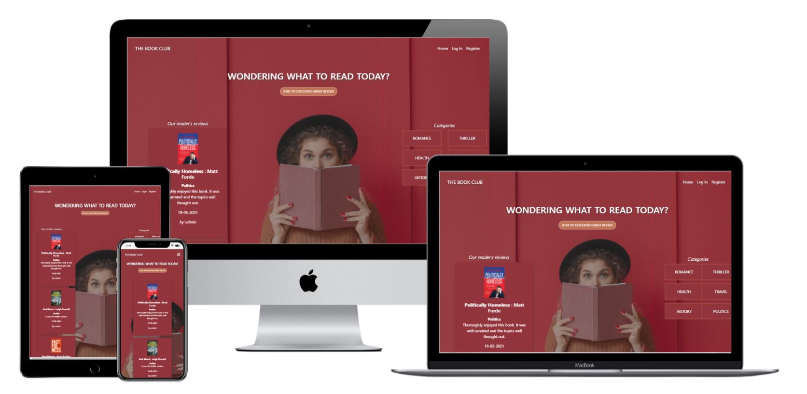
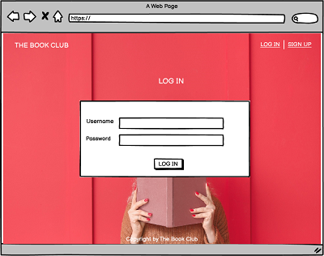

# The Book Club

Milestone Project 3 - Python and Data Centric Development

The website is created with the purpose to motivate people to read more books and share their opinions about the books they read.
The site will be targeted at the people who love to read books and people who doubt what to read.
Nowadays there is a huge choice of books for different ages, interests, and topics. Any one of us can get confused in this sea of books.
That is why book review and recommendation sites are here to help solve it. 
Existing user book reviews will help to choose and understand which could be your next book to read.
Go to website: https://the-book-club-dp.herokuapp.com/

## UX

### Mockup

### User stories

As a first time visitor, I want 
- to immediately understand what is the purpose of this website and easy navigate the site
- to see the content without being register
- to be able to see the Categories
- to be able to register easily without needing to input a lot of personal information
- to see that website is active and when is the latest book review added 

As a returning user, I want 
- to Log In and Log Out easily
- to be able to add new book review easily
- to be able to edit or delete my book reviews
- to upload my own images using URL address
- to have my dashboard and see all my reviews
- to Delete my profile easily

As a site owner/admin I want
- to be able to add, edit and delete categories

### Design Choices

The overall feel of the website is clean and not crowded. 
As a main element of the website, I chose a bright background image with a girl on it.
The image gives the right mood and fits with the headline.

#### Fonts

A website is made with Bootstrap, all fonts were given by default. 

#### Colours

As the background image was chosen in bright color itself, all other element colors are chosen neutral. For example, text color is white,
buttons and icons are nude/brown shade, the color name is Contessa.
This color was chosen because the same shade is a girl's sweater. This color match gives an overall clean feeling.
The only elements which differs is Delete buttons. 
They were left with their original color from Bootstrap, emphasizing these call-to-action buttons.

#### Icons

All icons used were chosen for their meaning and purpose so that everyone can understand them. 
The icon color is the same as the buttons and fits with the design.

Website consists of 5 sections:

- **Landing page**
- **Log In**
- **Register**
- **Profile**
- **Add Book** 
- **Manage Categories**

Wireframes are available here:

## Features

### Existing Features

Navbar on top helps user to navigate through the website. If you are logged-in user your Navbar shows more options than for the first-time visitor.
Web site Name in the left corner always brings the user back to the Landing page.
On the medium and small sizes, the user can open the navbar from the burger icon on the right top of the website. 

### Landing page

The Landing page includes a background image that gives an overall mood and is eye-catching with its main element-girl with the book in her hands.
Above the main element - the girl, there is the headline and inviting, call to action button, which takes the user to the Register page.
As a user, you can see randomly chosen other user book reviews. Reviews are listed in the column on the left side for the desktop version and in the center for the mobile version.
For the desktop version, reviews are listed on the left side and category list on the right side from the girl image.  
For the mobile version, reviews and categories are listed in the center.
As a user, you can see all book categories which is added by the website's admin. 

### Log In

As a user, you can see Log In form with Username and Password input fields. 
You must be a registered user to be able to Log In.
If the user is not registered yet, below the Log In form, there is a link that brings the user to the Register form.
After pressing Log In button, the user has been directed to a Profile page.

### Register

As a new user, you can Register to a webpage by filling the Register form with Username and Password input fields.
If the user uses an already existing username, flashes the message, that the Username already exists.
If registration was successful, the user has been directed to the Profile page.

### Profile

As a user, you can see your Profile page where you can see and manage all your added book reviews.  
User's reviews are listed in a row and gives you the option to Edit or Delete it.
As a user, you are able to add a new book review by pressing the button Add Book which is located above the list.
After pressing the button, the user has been directed to Add New Book Review form.

### Add Book

As a user, you are able to add a new book review by filling out the form. All input fields must be filled in to be able to submit the form.
You are able to Cancel this action by pressing the Cancel button below the form.
Canceling this action clean form will be displayed.

### Manage Categories

As an admin, you are able to manage existing Categories.  
If you are logged in with an admin username, your Navbar shows the option Manage Categories.
Pressing the link, an admin has been directed to the categories page, where all categories are listed in columns and offers the option Edit or Delete them.
As an admin, you are able to Add, Edit, or Delete the Category by pressing the call-to-action buttons.
Pressing the button Add Category admin can see a form that needs to be filled in and submitted.
After submitting admin has been directed back to the category page where the added category has been listed together with others. 
All categories are listed in alphabetical order.

### Features left to implement

- In the future, I would like to add a section with books that are most reviewed. Section name could be - Most read books by our users.
- I would like to implement that visitors can see how many active users this website has.
- Every time when admin adds a new Category, this Category automatically adds to the list on Landing page.
- Clicking on one of the categories user is taken to another page with a book list which was added to this category by all users.
- On the landing page, I would like to add that it is visible only random 4-5 added book reviews and they change every time user refresh the page.
- In the future I would like to add confirmation modal for the action when users wants to Delete something.

## Technologies Used

- HTML
- CSS 
- JavaScript
- Python+Flask
- [Bootstrap v4.6](https://getbootstrap.com/docs/4.6/getting-started/introduction/)
- jQuery
- MongoDB

## References

- Code institute video projects, especcially Mini Project by Tim Nelson
- [W3scools.com](https://www.w3schools.com/)
- [Stackoverflow](https://stackoverflow.com/)
- [WebFX](https://www.webfx.com/blog/web-design/responsive-background-image/)
- [CSS Tricks](https://css-tricks.com/couple-takes-sticky-footer/)

## Testing

For testing code validity i used:

* [HTML Validator](https://validator.w3.org/)
* [CSS Validator](https://jigsaw.w3.org/css-validator/)
* [JavaScript Validator](https://jshint.com/)
* [Python Validator](http://pep8online.com/)

### User stories testing

1. As a first time visitor, I want to immediately understand what is the purpose of this website and easy navigate the site.

    * Background image, logo and headline gives clear indications about purpose of the site.
    * Navigation bar is easy to find and use.
    * The logo ans Home link on navigation bar always leads back to home page.

2. As a first time visitor, I want to see the content without being register.

    * On the Home page there are listed user book reviews also avialable to read for not registered users.
    
3. As a first time visitor, I want to be able to see the Categories.

    * On the Home page there is list with book Categories.

4. As a first time visitor, I want to be able to register easily without needing to input a lot of personal information.

    * Call to action button on Home page leads new visitor to Register page.
    * It is easy to find Register link on Navigation bar.
    * To register to this site visitor needs to insert Username and Password.
    * To Submit the registration form, visitor needs to insert 5-15 characters for each Username and Password.
    * Entering any other amount of characters for Username and Password, Pops up tooltip "Please match the requested format."
    * Information about what format is exactly requested is missing.

5. As a first time visitor, I want to see that website is active and when is the latest book review added.

    * Book reviews on Home page contains information about date when book review was added.

6. As a returning user, I want to Log In and Log Out easily.

    * Log In link is easy to find on Navigation bar.
    * Entering wrong Username/Password flashes message "Incorrect Username and/or Password!"
    * Once form is submitted Welcoming user message flashes.
    * Log Out link is easy to find on Navigation bar.

7. As a returning user, I want to be able to add new book review easily.

    * Once user is succesfully logged in opens user's Profile page.
    * Add Book button is easy to find on Profile page.
    * Clicking the Add Book button opens the Add New Book Review form
    * Input fields are easy to understand and for better understanding contains icons.
    * Input fields have red border and small red exclamation mark indicating that all input fields must be filled before submit the form.
    * After filling the input field border color changes to green and checkmark appears.
    * There is Cancel button in the bottom right corner to cancel the action. 

8. As a returning user, I want to be able to edit or delete my book reviews.

    * Each book review has its own book card, containing all added information.
    * Edit and Delete buttons are placed for each of user's cards.
    * Clicking the Edit button opens the same form as when added new book review.
    * URL address is missing and needs to be added again before submitting this form.
    * There is Cancel button in the bottom right corner to cancel the action.
    * Clicking the Delete button on book card, book review has been deleted and as confirmation flashes the message "Book Review Successfully Deleted".
    * Confirming modal for this action is missing.

9. As a returning user, I want to upload my own images using URL address.

    * To Add New Book Review user needs to enter URL address to add book image.
    * URL address validation is missing.

10. As a returning user, I want to have my dashboard and see all my reviews.

    * Once user is logged in Profile link is easy to find in Navigation bar.
    * User's Profile page contains Add Book button, which leads to form, user's book reviews with option to Edit or Delete them
      and call to action button Delete Profile.

11. As a returning user, I want to Delete my profile easily.

    * Clicking the Delete Profile button user's profile has been deleted, as confirmation, flashes the message "Your Profile Successfully Deleted".
    * Confirming modal for this action is missing.

12. As a site owner/admin I want to be able to add, edit and delete categories.

    * Once admin is logged in Manage Categories link is easy to find in Navigation bar.
    * Manage Categories page consists of all added Categories, Edit and Delete call to action buttons, as well as Add Category button.
    * Clicking the Add Category button admin opens form where admin needs to insert name of new Category and submit the form.
    * New Category has been added to list with other Categories on Manage Categories page. 
    * Clicking the Edit button opens form with existing Category name. 
    * Admin can change name of category and submit the form or Cancel the action by clicking Cancel button in the bottom right corner.
    * Clicking the Delete button Category has been deleted, as confirmation, flashes the message "Category Succesfully Deleted". 

## Deployment

The website is hosted usign GitHub and deployed to Heroku.
I started by creating a new repository with `git init`. Then each update was done by the command `git add -A` and then committing it to my local repo with the command `git commit -m ”message”`.
Then I uploaded it to my remote repo (Github) using `git push`.

To deploy website to Heroku, I take following steps:
- Create a requirements.txt file by writing terminal command pip freeze --local > requirements.txt.
- Create Procfile using terminal command echo web: python app.py > Procfile.
- Log In into my Heroku.com account and click "New" > "Create New App" button in my dashboard. Give it a name and set the region to Europe.
- From the dashboard, click "Deploy" and choose GitHub as Deployment method. That will setup automatic deployment from GitHub repository.
- Add my repository name and confirm it by clicking "Connect".
- From the dashboard, click "Settings" > "Reveal Config Vars".

KEY | VALUE
----|-----
IP | 0.0.0.0
PORT | 5000
SECRET_KEY | <your_secret_key>
MONGO_URI | mongodb+srv://<username>:<password>@<cluster_name>.6wwxi.mongodb.net/<database_name>?retryWrites=true&w=majority
MONGO_DBNAME | <database_name>

- Back in terminal write command git add requirements.txt and git commit -m "Add requirements.txt", 
the same with Procfile - git add Procfile and git commit -m "Add Procfile" and then git push the project to GitHub.
- In the heroku dashboard click "Deploy". 
 

## Credits

### Content

All the content on this website was written by me.

### Media

Background image was taken from [Shutterstock](https://www.shutterstock.com/da/image-photo/beautiful-young-woman-warm-sweater-book-1656315796).
URL of book images were taken randomly from Google.

### Acknowledgements

- I received inspiration for this project from Code Institute Mini Project by Tim Nelson 
- Code Institute tutor assistance
- Slack community
- My mentor Spencer Barriball

Website is created for educational use!
